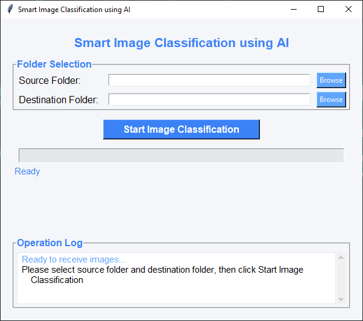

# Smart Image Classification App using AI

This project is a Python-based GUI application that automatically classifies images into folders based on their content (such as: people, food, animals, nature...) using OpenAI's **CLIP** AI model.

## 💡 Concept
The application compares each image with a set of text descriptions using the CLIP model (version: `clip-vit-base-patch32`) to select the most appropriate category. Files are then automatically moved to folders named after the appropriate category in English.

---

## ✨ Features
- Smart classification using OpenAI's pre-trained CLIP model
- Easy and fast GUI built with Tkinter
- Supports common image formats (JPG, JPEG, PNG, BMP, GIF)
- Organizes images into categorized folders:
  - People, Food, Animals, Plants, Nature, Buildings, Vehicles, Others
- Displays process progress and provides text log for all events
- Real-time status updates during classification
- Confidence score display for each classification
- Multi-threaded processing to prevent UI freezing
- Responsive design with resizable interface

---

## 🛠️ Requirements

Python 3.8 or newer is required, along with the following packages:

```bash
pip install torch transformers Pillow
```

Or install via `requirements.txt`:
```bash
pip install -r requirements.txt
```

### System Requirements
- **RAM**: Minimum 4GB (8GB recommended for better performance)
- **Storage**: At least 2GB free space for model caching
- **OS**: Windows, macOS, or Linux

---

## 🚀 How to Run

1. Make sure you're in the project directory
2. Run the application with the command:
```bash
python image_classifier.py
```
3. Select the source images folder
4. Select the destination folder where classified images will be moved
5. Click "Start Image Classification" button

Application interface during folder selection and classification process:


---

## 📂 Supported Classifications
- **People** - Photos containing human subjects
- **Food** - Images of meals, dishes, and food items
- **Animals** - Pictures of pets, wildlife, and various animals
- **Plants** - Flowers, trees, gardens, and botanical subjects
- **Nature** - Landscapes, natural scenery, and outdoor environments
- **Buildings** - Architecture, houses, and structural subjects
- **Vehicles** - Cars, trucks, motorcycles, and transportation
- **Others** - Miscellaneous items that don't fit other categories

---

## 🔧 Technical Implementation

### Model Architecture
- **Base Model**: OpenAI CLIP (clip-vit-base-patch32)
- **Vision Encoder**: Vision Transformer (ViT) with 32x32 patches
- **Text Encoder**: Transformer-based text encoder
- **Image Processing**: Images resized to 224x224 pixels
- **Classification Method**: Cosine similarity between image and text embeddings

### Performance Optimization
- **Threading**: Background processing to maintain UI responsiveness
- **Batch Processing**: Efficient handling of multiple images
- **Memory Management**: Automatic model caching and cleanup
- **Progress Tracking**: Real-time updates on classification progress

---

## 📝 Notes
- CLIP model is automatically downloaded on first run from `transformers`
- Files are copied (not moved) to maintain original folder structure
- Model is cached locally, no need to re-download on subsequent runs
- Classification accuracy depends on image quality and content clarity
- The app creates category subfolders automatically in the destination directory

---

## 📸 Practical Example
If you select an image of a child eating pizza, the model might classify it as "Food" or "People" based on the higher similarity score. The confidence percentage is displayed in the operation log.

---

## 🧠 Technologies Used
- **Python** - Core programming language
- **Tkinter** - GUI framework
- **PyTorch** - Deep learning framework
- **Transformers (HuggingFace)** - Model loading and processing
- **PIL (Pillow)** - Image processing and manipulation
- **Threading** - Concurrent processing
- **OS/Shutil** - File system operations

---

## 🔍 Troubleshooting

### Common Issues:
1. **Model Download Error**: Ensure stable internet connection for initial model download
2. **Memory Issues**: Close other applications if running on systems with limited RAM
3. **Image Format Error**: Verify images are in supported formats (JPG, JPEG, PNG, BMP, GIF)
4. **Permission Error**: Ensure write permissions for destination folder

### Performance Tips:
- Use SSD storage for faster model loading
- Process images in smaller batches for systems with limited RAM
- Ensure images are not corrupted before processing

---

## 🚧 Future Enhancements
- Custom category definition
- Batch processing optimization
- Multiple language support
- Advanced filtering options
- Integration with cloud storage
- Custom model training capability

---

## ⚖️ License
This project is open source and available for free use and development.

---

## 🤝 Contributing
Contributions are welcome! Please feel free to submit pull requests or open issues for bugs and feature requests.

---

If you found this project helpful or interesting, don't forget to share it or give it a star ⭐
